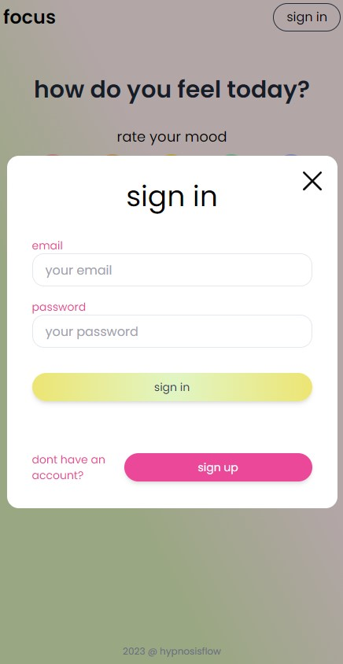

#focus-app client

## install
```js
   focus-app\client> npm i
```

## run 
```js
   focus-app\client> npm run dev
```

<center></center>

features and flow

after registration you get the access to full app flow and personal data store.

mood tracker:
   minalistic design but time saving and also accurate flow to collect information how you feel your self and what can impact on it. 

   1. register avatar
   2. input overall score of mood add emojis which can describe your state.
   3. next is a simple condition select and you are free to add specific notes which can relate.
   4. check preview card.
   5. get the results in a simply made graphs and history feed.
   